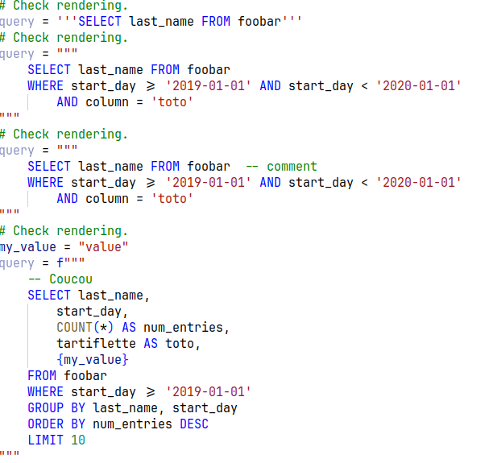
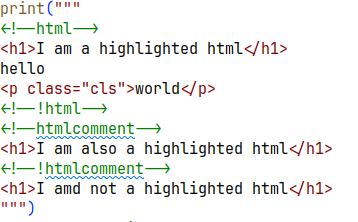

# SQL highlighting in Python multiline strings for VS Code

Adds automatic syntax highlight support SQL and HTML strings embedded in Python strings.

**This is still under development,** if you experience issues please try to help us fix them. :)  Auto detecting SQL, and highlighting it properly insight Python is _hard_!

To limit bugs (like highlighting words that are SQL keywords in the wrong places) and ease stopping of highlight when we must, I made the following simplifications:
- The extension will not work for SQL embedded in Python comments or docstrings.
- To be considered SQL, the string must start with a SQL keyword _fully capitalized_ or a double dash (`--`) denoting a comment. You can only have white spaces before the keyword. This is to avoid wrong detection of SQL in the middle of the string.
- Same goes for HTML, you must start by a tag or a comment (see the demo files for more).

Please note:
- That the demo files (`docs/sql_demo.py` and `docs/html_demo.py`) are also used to check that the extension behaves correctly in all cases. If you find a bug, please add it to the file so we can avoid regressions.
- That Python strings that contains a SQL comment at the end of the string are not support and will make highlighting bug. So `query = "SELECT * FROM my_table -- WHERE col IS NOT NULL"` will break everything. This is because (as far as I know at least) SQL comments ends when a line ends and the extension cannot force it to end before that. Since the extension missed the end of the string, we cannot recover from this. Note that multi-line strings are not concerned by this as long as you put the end quotes on another line. So, this will fail:
   ```python
   query = """SELECT * FROM my_table
   -- WHERE col IS NOT NULL"""
   ```
   But this will work as expected:
   ```python
   query = """SELECT * FROM my_table
   -- WHERE col IS NOT NULL
   """
   ```
- Likewise an unclosed HTML tag will break everything.

View on extension on the [VS Code Marketplace](https://marketplace.visualstudio.com/items?itemName=jenselme.better-python-strings), or source code [Github](https://github.com/Jenselme/better-python-strings).




## Community
- 2021-12-13 forked from [python-string-sql](https://github.com/ptweir/python-string-sql)
- 2023-11-26 forked from [better-python-string-sql](https://github.com/Submersible/better-python-string-sql)

## Release Notes

### [1.0.0] - 2023-11-26
- Add support for CTE
- Improve detection of end of SQL strings
- Add support for HTML

### [0.0.1] - 2021-12-13
- Made it so adding `--(begin-)?sql` and `--end-sql` is not necessary!
- Forked from es6-string-html
